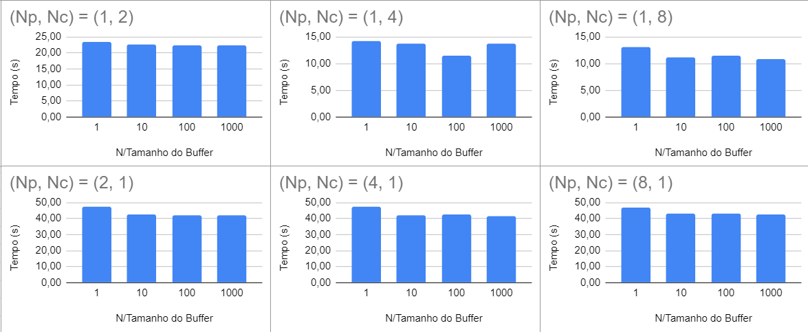

# COS470 - Distributed Systems Thread-sync - Trabalho Prático 2
```
g++ -o Main main.cpp -mcmodel=large
```

```
./Main
```

```
g++ -o Main2 main2.cpp
```

```
./Main2
```

---

Filipe Prates - 116011311
Enunciado: [https://www.cos.ufrj.br/~daniel/sd/trabalhos/TP2.pdf](https://www.cos.ufrj.br/~daniel/sd/trabalhos/TP2.pdf)

Utilizado WSL, processador 2 núcleos / 4 Processadores lógicos
Intel(R) Core(TM) i5-10300H CPU @ 2.50GHz / 8GB RAM / (porém WSL com acesso à 4GB)

**Produtor-Consumidor com Semáforos**

Várias threads produzindo e consumindo dados através de memória compartilhada. Temos que garantir a seriabilidade do acesso àos dados compartilhados, nesse trabalho utilizando semáforos.

Utilizar dois semáforos: Um contando o número de posições do vetor ocupadas com um potencial-primo, e o outro controlando o número de posições livres.

Os produtores precisam esperar que vague pelo menos uma posição no vetor para produzir o próximo, e os consumidores precisam esperar que tenha pelo menos uma posição ocupada no vetor para continuar consumindo.

```cpp
// produtor
void produtor() {
    int num;
    while (true) {
        num = rand() % N + 1;
        {
            unique_lock<mutex> lock(mtx);
            // Aguarda até ter posições vazias
            posicoes_vazias.wait(lock, []{return buffer.size() < BUFFER_SIZE;});
            buffer.push(num);
            cout << "Produziu " << num << " (posições ocupadas:" << buffer.size() << ")" << std::endl;
            posicoes_cheias.notify_one();
        }
    }
}

//consumidor
void consumidor() {
    int num;
    while (true) {
        {
            unique_lock<mutex> lock(mtx);
            // Aguarda até ter posições preenchidas
            posicoes_cheias.wait(lock, []{return !buffer.empty();});
            num = buffer.front();
            buffer.pop();
            cout << "Consumiu  " << num << " (posições ocupadas:" << buffer.size() << ")" << endl;
            posicoes_vazias.notify_one();
        }
        bool is_prime = isPrime(num);
        cout << "É Primo? " << is_prime << endl;
    }
}
```

Estudo de Caso:


| N | (Np, Nc) = (1, 1) | (Np, Nc) = (1, 2) | (Np, Nc) = (1, 4) | (Np, Nc) = (1, 8) | (Np, Nc) = (2, 1) | (Np, Nc) = (4, 1) | (Np, Nc) = (8, 1) |
| ---- | ----------------- | ----------------- | ----------------- | ----------------- | ----------------- | ----------------- | ----------------- |
| 1 | 46.0035 | 23.411 | 14.1639 | 13.0763 | 47.5166 | 47.3959 | 46.8786 |
| 10 | 42.4733 | 22.6221 | 13.6876 | 11.1619 | 42.7791 | 42.1194 | 43.1623 |
| 100 | 41.3755 | 22.3656 | 15.782 | 11.4846 | 42.2354 | 42.4024 | 43.2661 |
| 1000 | 41.3499 | 22.3815 | 13.7577 | 10.7538 | 41.9305 | 41.7098 | 42.5141 |


Podemos concluir que o número de Consumidores é bem mais importante para o tempo de execução comparado ao número de produtores. O que faz sentido, já que consumir um número e determinar se é primo é significativamente mais complexo que gerar um número aleatório, logo um só produtor pode produzir para muitos consumidores.


Além disso, quanto maior o buffer, mais tempo estamos ativamente produzindo e consumindo, e menos tempo parado esperando o buffer esvaziar ou encher, logo tem um impacto no tempo de execução. Porém o buffer pode ser grande o suficiente que a velocidade de consumação é suficiente para nunca encher o buffer, ou se a produção for muito mais rápida o buffer vai sempre estar cheio, a partir desses momentos um buffer maior não determina um tempo de execução menor, como no nosso experimento t(produzir) << t(consumir), não influenciou tanto (segundo caso); No caso que t(produzir) ~= t(consumir) provavelmente influencia mais.

Exemplos \***\*\*\*\*\***Gráficos do Preenchimento do Buffer:\***\*\*\*\*\***

Gravei o quão cheio estava o buffer (buffer.size()) em cada momento que um consumidor retirava um elemento do buffer para consumí-lo.

O resultado foi posto em gráficos através de python/pandas/seaborn, com um “zoom” maior ([100] primeiros elementos), conseguimos ver claramente o Buffer enchendo e esvaziando, na medida que o Consumidor ia retirando os elementos do buffer.


A medida que visualizamos um tempo maior ([500] primeiros elementos consumidos), vemos como as threads estão sendo escalonadas com outros processos.
Com mais consumidores conseguimos ver que o Buffer fica mais tempo vazio.


Com um buffer maior o preenchimento/esvaziamento é mais “contínuo”, e percebemos claramente as interrupções regulares (não está claro pra mim o que seriam, interrupções da SO que os produtores ficam regularmente um tempo sem atuar? Imaginaria que com Np > 2 esses Gaps ficariam menores/diferentes (padrão de overlap de pausas))

Vemos, ao chegar nos gráficos de buffer de 1000 elementos, quase retângulos, já que enquanto os Produtores estão rodando, o buffer sempre fica cheio (é rápido encher e demora esvaziar), e quando não estão, o buffer rapidamente zera e espera os Produtores voltarem)


Todos os gráficos estão disponíveis no arquivo [/outputBuffersData/outputBufferGraphs.ipynb](https://github.com/FilipePrates/COS470-Distributed-Systems--Trab2--Thread-Sync/blob/main/outputBuffersData/outputBufferGraphs.ipynb).

---

**Somador com Spinlock**

Aproveitar de múltiplas threads para paralelizar o trabalho de computar uma soma.
Somar todos os valores de um array **N**, onde **cada elemento de N é um inteiro entre [-100,100]**.

Dividir o trabalho em **K** threads.

Ter uma variável de “SomaTotal”, que é compartilhada controladamente entre as threads. Quando cada uma das threads termina seu trabalho de somar N/K números, retorna e adiciona à SomaTotal. Para ter esse cuidado que cada thread “espera sua vez” para somar na SomaTotal, evitando race-conditions, utilizaremos uma variável que vai controlar o acesso à região crítica como vimos em aula.

```cpp
// Código à ser executado em cada thread, somando localmente, pedindo acesso
// e atualizando a somaTotal
void soma(int start, int end) {
    int somaLocal = 0;
    for (int i = start; i < end; i++) somaLocal += vetorASerSomado[i];
    acquire();
    somaTotal += somaLocal;
    release();
}
```

```cpp
// Core da thread Main que cria e espera as threads filhas a somarem seu sub-vetor,
// definido pelo seu começo e fim, separamos N/K do vetor para cada uma das K threads
thread threads[K];
for (int i = 0; i < K; i++) {
    threads[i] = thread(soma, i * (N / K), (i == K-1) ? N : (i+1) * (N / K));
}
for (int i = 0; i < K; i++) {
    threads[i].join();
}
```

Estudo de Caso (valores médios em segundos de tempo de execução, média de 10 runs):

N = $10^7$


N = $10^8$


N = $10^9$

Erro ao setar o int N como 1000000000

main.cpp:(.text+0xb2): relocation truncated to fit: R_X86_64_PC32 against symbol `somaTotal' defined in .bss section in /tmp/ccSKJ6l6.o /tmp/ccSKJ6l6.o: in function` main': ->
adicionando a flag -mcmodel=large no compilador funcionou.

Na terceira coluna os resultados de runs individuais (demorou bastante a ponto de acreditar que tinha algum erro com um for 10, preferi executar separadamente, utilizei esse documento para guardar os resultados parciais)

| K = 1   | 54.74643  | 35.9942,41.3256,34.6941,40.7889,43.5088,58.4705,79.0929,83.1048,69.3813,61.1032    |
| ------- | --------- | ---------------------------------------------------------------------------------- |
| K = 2   | 17.371369 | 14.6733,17.573,3.97909,25.1242,19.7905,18.6938,13.4929,13.0081,26.6472,20.7316     |
| K =4    | 9.438053  | 5.285,10.993,7.17191,9.42467,5.19341,10.0524,8.98634,10.7635,11.3406,15.1697       |
| K = 8   | 4.619571  | 2.78254,2.93493,3.92152,4.16165,4.19582,3.29088,5.0613,8.15226,4.7594,6.93541      |
| K = 16  | 3.766332  | 7.60298,2.65938,2.92137,3.16269,3.11731,3.19761,3.51101,3.53335,3.2892,4.66842     |
| K = 32  | 2.241661  | 1.63729,1.71236,1.72265,2.15681,1.89469,2.33747,2.3305,2.40658,3.29356,2.9247      |
| K = 64  | 2.0837648 | 6.11468,0.985868,1.51537,1.55987,1.36746,1.63349,1.37853,2.11563,1.7342,2.43255    |
| K = 128 | 2.1300516 | 0.971584,0.893767,1.35458,0.982905,1.45732,1.65724,1.50404,2.74034,7.73725,2.00149 |
| K = 256 | 1.8777493 | 0.838451,0.617362,1.3238,1.17896,2.15682,2.84061,2.39025,2.44053,3.0351,1.95561    |


---

### Enunciado

[WrittenReport.pdf](README/WrittenReport.pdf)
